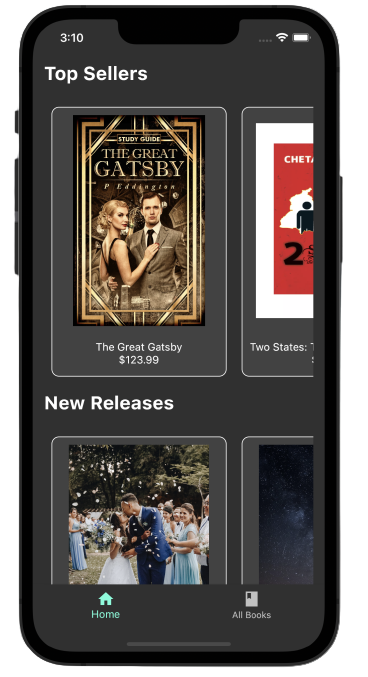
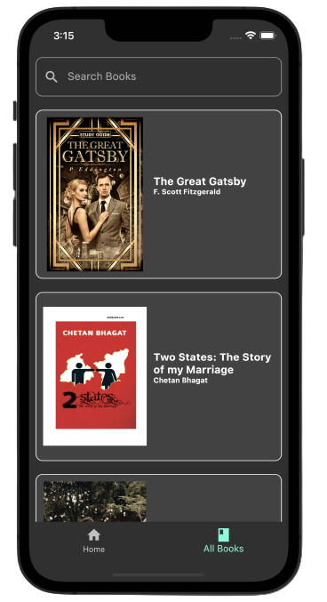
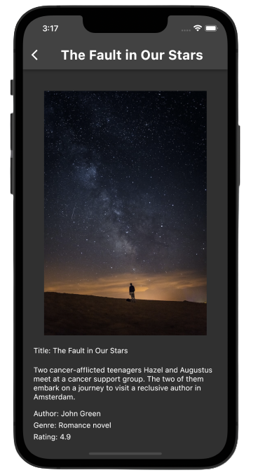
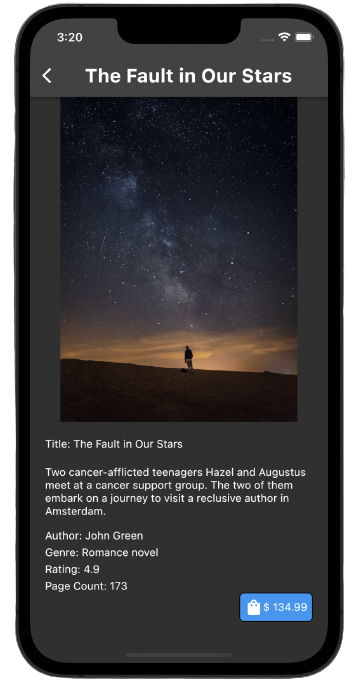

# BookApp
A simple book store application built using Flutter, powered by Node.js &amp; MongoDB backend

## Application Screenshots
Home            |  All Books
:-------------------------:|:-------------------------:
  | 

Book Details            |  Book Details 
:-------------------------:|:-------------------------:
  | 
